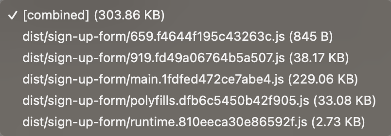
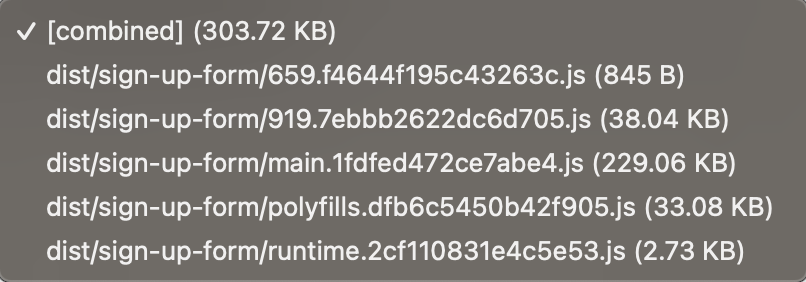

# Sign Up Form

This project was generated with [Angular CLI](https://github.com/angular/angular-cli) version 16.1.2.

## Run

Run `npm run start`. Navigate to `http://localhost:4200/`.

## Testing

Run `npm test` to execute the unit tests via [Jest](https://jestjs.io/).

Since this is a small application I chose to replace jasmine/karma with Jest.

1. It's easier to use and requires less setup.
2. It runs tests faster, giving you quicker feedback (also better for CI).
3. It has built-in mocking capabilities, making testing easier.
4. Angular is deprecating Karma and is officially going to support Jest. (I'm really curious about the development of this)

I considered using Cypress for component and integration testing, but chose to "just" test with Jest only.
Since the application is really small I thought it was a bit overkill to add Cypress. If this project would grow, I would add it later.

In this application I added unit tests for the services and the validator. Besides that I added integration tests for the smart sign up component.

## Architecture

I tried to setup this project with Nx in mind. My goal with this setup is to make it as easy as possible to migrate to Nx.
Besides that I do believe a project structured like this is easier to work in. Everything around a domain can be found in one library(folder).
For example, a developer doesn't have to look through a whole app the find certain services. Instead he or she can go to the domain library(folder).

Besides that I used the following:

1. Standalone components
> Since this is a small project, I decided to go for only standalone components

  - Standalone components can work on their own without depending too much on other parts of the code.
  - Therefore, it makes the code more modular and easier to maintain, keeps things organized, and makes it easier to make changes or add new features to the application.

2. Lazy loaded routes and component
  - It can greatly improve the initial loading speed of the app. Since the app is so small it does not really matter, but I think it's an important practise to follow.

3. What did I not do?
> The assignment of this project is to sign up a user. I considered saving this user in a store, adding a guard to a logged in route, adding error handling etc. 
> But I felt like I was going down a rabbit hole and not stop ;). For now this app has an infinite sign up flow.

  - I would create a separate `auth.store.ts` service where a `BehaviourSubject<AuthUser>` would live.
  - I would add a logged in and not logged in home route, handled by a guard that checks the value in the auth store.
  - I would add logged out flow/route.
  - I would add global error handling maybe supported by a snackbar.

4. Using `Inject()`
> Currently while I'm writing this I did not use Inject() over the constructor. 
> I've refactored this app to only use inject(), but I did **not** push this.

I haven't worked professionally with `inject` yet, but what I've read is that it can lead to reduced bundle sizes, code that is easier to understand, maintain, and refactor.

For example in the smart sign up component it would look like:

```
submitForm(): void {
    if (this.signUpForm.invalid) {
      return;
    }

    this.loading$.next(true);

    inject(AccountService) <----
      .signUpUser(this.firstName.value, this.lastName.value, this.email.value)
      .pipe(finalize(() => this.loading$.next(false)))
      .subscribe({
        next: () => this.navigateTo('./success'),
        error: () => this.navigateTo('./failure'),
      });
  }

  private navigateTo(path: string): void {
    inject(Router).navigate([path], { <----
      relativeTo: inject(ActivatedRoute), <----
    });
  }
```

This component, now without the constructor, looks a lot cleaner. So I agree on the readability part. Lets see if, even for this small app, the bundle size is reduced.

| Before                                   |                  After                  |  
|------------------------------------------|:---------------------------------------:|
|  |  |  

It seems like it does! But not as much to be worth the refactor (for now).

I do think it makes testing harder. Since I've already chosen to use Jest in this project, I ran into some issues with mocking,
I would now reconsider using Jest for integration/component tests and switch to Cypress. For now this is the reason I did not push the refactor. 

On this subject I would really like to discuss with other developers what they think, and on how and when to use it over the constructor.

--- 

### Thank you for taking the time to review this assignment. I appreciate your effort and feedback.
